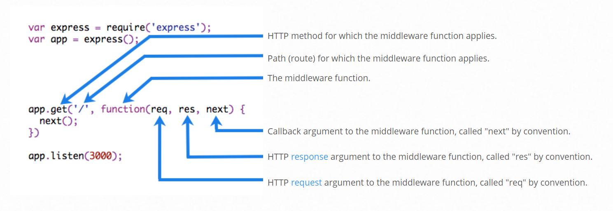

# Node Js

- Javascript used for server side.

1. Express
	- 1.1. Structure of Express file
	- 1.2. Routing
	- 1.3. Applying Css
	- 1.4. EJS
	- 1.5. Advantage of EJS
	- 1.6. Middlewares
2. REST
	- 2.1. Stateless Server
3. Database
	- 3.1. SQL Databases
	- 3.2. NoSQL Databases
	- 3.3. MongoDB
	- 3.4. Mongoose ODM
	- 3.5. Mongoose Population
4. Authentication
	- 4.1. Types of Authentication:
	- 4.2. Cookies Based Authentication
	- 4.3. Sessions Based Authentication
		- 4.3.1 Passport
	- 4.4. Token Based Authentication
		- 4.4.1 JWT (JSON Web Token)
5. Backend as a Service (BaaS)
	- 5.1. HTTPS ans Secure Communication
		- 5.1.1 Cryptography
		- 5.1.2 SSL/TLS
		- 5.1.3 Steps generated Secure Server


## 1. Express

- It is a framework for developing web apps with Node.js.
  Using frameworks helps make development a lot more efficient.

```sh
npm install express
```

```js
const express = require('express');
const app = express();
```

- To start the server, we need to add the listen method to app.js, then run it in the terminal using the following command: node `file_name`.

### 1.1 Structure of Express file

- To review, the typical structure of an Express.js app fig(which is usually a server.js or app.js file) roughly consists of these parts, in the order shown:

1. Dependencies : A set of statements to import dependencies
2. Instantiations : A set of statements to create objects
3. Configurations : A set of statements to configure system and custom settings
4. Middleware : A set of statements that is executed for every incoming request
5. Routes : A set of statements that defines server routes, endpoints, and pages
6. Bootup : A set of statements that starts the server and makes it listen on a specific port for incoming requests

### 1.2 Routing

- Determining how the app responds to a request to a particular URL is called routing.

```js
// /top : page we need to access
// () => {} : Route Handler/ route handling function which take two parameters req(requst), res(response)
app.get('/top', (req, res) => {
	// Display the top page
	res.render('top.ejs');
});
```

- You can specify which view file to show on the browser using the res.render function.

### 1.3 Applying Css

- store Css and image in folder
- and use below line to access in code:

```js
app.use(express.static('public')))
```

### 1.4 EJS

- Embedded JavaScript
- EJS is a Node.js package that lets you embed JavaScript code in your HTML file.
```sh
npm install ejs
```
- To embed JavaScript code, we can use <% %> or <%= %>.
- <% %> is used in cases like defining a variable as it won't be displayed.
- <%= %>, on the other hand, is used for cases like printing a variable as it will be displayed.
  
  

### 1.5 Advantage of EJS

- With EJS, you will be able to use the forEach method, which will make the code much simpler and easier to manage than plain HTML.
  
  

### 1.6. Middlewares
 - **Middleware functions are functions that have access to the request object (req), the response object (res), and the next function in the application’s request-response cycle.**

```js
	// Middleware
	app.use(logger('dev'));
	app.use(express.json());
	app.use(express.urlencoded({ extended: false }));
	app.use(cookieParser());
	app.use(auth);
	app.use(express.static(path.join(__dirname, 'public')));
```

 - Middleware literally means anything you put in the middle of one layer of the software and another
 - Express middleware are functions that execute during the lifecycle of a request to the Express server.
 - Each middleware has access to the HTTP request and response for each route (or path) it’s attached to.
 Middleware functions can perform the following tasks:
	- Execute any code.
	- Make changes to the request and the response objects.
	- End the request-response cycle.
	- Call the next middleware in the stack.
 

 - **NOTE:** GET, POST, PUT, etc can also be middleware functions. e.g.
 ```js
 // middleware function will run one after another in sequence
 dishRouter.route('/:dishId').post(
	 middleware_function_1(),
	 middleware_function_2(),
	 middleware_function_3()
	 )
 ```

## 2. REST (Representational Statr Transfer)

- two common approaches to support web services

  1.  SOAP (Simple Object Access Protocol) / in XML format
  2.  REST (XML/JSON)

- Four Basic design principles:
  1.  Use HTTP Methods explicitly
  2.  Be stateless - don't store any info about state after communication is completed. (received request and replies and don't store any info about this transaction)
  3.  Expose directory structure-like URLs (Uniform Resource Locator)
  4.  Transfer using XML(Extensible Markup Language), JSON (Javascript Object Notation)
- REST Concept
  1.  Noun - Resource/URL
  2.  Verb - GET, PUT, POST, DELETE
  3.  Representations: XML/JSON

#### 2.1 Stateless Server

- Server side should not track client state, if server does those thing server WILL NOT BE SCALABLE.
- for scalable implementation server on serve side should be stateless

## 3. Database

### 3.1 SQL Databases

- Structural database, tabular
- like MySQL

```sh
npm install mysql
```

#### Setup

- We'll store the required information in a constant called connection

```js
const mysql = require('mysql');
const connection = mysql.createConnection({
	// database name, password,etc
});
```

### 3.2 NoSQL Databases

- NoSQL bases database, address some challenges encountered with SQL databases
- Four broad categories:
  - Document databases (MongoDB)
  - Key-value databases (Redis)
  - Column-family databases (Cassandra)
  - Graph databases (Neo4J)
- **why NoSQL**

  - Scalability
    - Availability
    - Consistency
    - Partition tolerance
  - Ease of deployment
    - No object-relation mapping required

- **Structure of document database**
- Document: A self-contained piece of information (e.g. json document)
- collection: collection of documents
- Database: A set of collections

### 3.3 MongoDB

- Document database
- MongoDB stores document in More compact form, BSON (Binary JSON)
- BSON supports
  - length prefix on each value
  - information about type of field value
  - Additional primitives types not supported by raw json like UTC date time, raw binary, ObjectId
- MongoDB ObjectId:
  - Every document must have "_id" (unique primary field)
  - Default ObjectId created by Mongo
  - ObjectId is a 12 byte field
  ***
  | Timestamp(4) | Machine Id(3) | ProcessId(2) | Increment(3) |
  ***
  - e.g.
  ```bson
  {
  	"_id"	:	ObjectId("56ce74c0b02806eff4558f1f"),
  	"name"	:	"Uthapizza",
  	"description"	:	"Test"
  }
  ```
  - Install MongoDB in your pc
  - After that to run mongo server
  ```sh
  mongod --dbpath="D:\Learning\Full-Stack\mongodb\data" --bind_ip 127.0.0.1
  mongo
  ```
  - then install mongoDB driver in nodejs
  ```sh
  npm install mongodb --save
  npm install assert --save
  ```

### 3.4 Mongoose ODM

- Adds sturcture to MongoDB documents through schema
- Mongoose internally use MongoDB Driver
- Means you can use all MongoDB driver method through Mongoose modules
- people refers as:
  - Object Data Model (ODM)
  - Object Document Mapping (ODM)
  - Object relational Mapping (ORM)
- **Mongoose Schema**
  - Structure of the data to be stored
  - Defines all the fields of your document and their types (Can do validation)
  - Schema types:
    - string
    - number
    - date
    - buffer
    - boolean
    - Mixed
    - ObjectId
    - Array
  - Schema is used to create a model function
  - Schema can be nested
- **Process**

  - Define the schema in Nodejs application

  ```js
  const mongoose = require('mongoose');
  const Schema = mongoose.Schema;

  const dishSchema = new Schema(
  	{
  		name: {
  			type: String,
  			required: true,
  			unique: true,
  		},
  		description: {
  			type: String,
  			required: true,
  		},
  	},
  	{
  		timestamps: true,
  	}
  );
  ```

  - NOTE: Mongoose can automatically createdAt, updatedAt like field in documents by using `timestamps: true` parameter
  - Create a model from that schema

  ```js
  var Dishes = mongoose.model('Dish', dishSchema);
  ```

  - you will also give a name to the model e.g. Dish
  - When you use this model in our node application where we are making use of Mongoose, then this will be transformed and mapped into a collection in MongoDB database.
  - Mongoose automatically construct the plural of that name and then give the collection the name, which is the plural of the model name that you specify in this example here.
  - Then exports this model

  ```js
  module.exports = Dishes;
  ```

### 3.5. Mongoose Population
- Mongoose do not explicitly support relations like SQL Databases
- You can store references to other documents within documentb by using ObejctIds
- Mongoose doesn't have joins
- Mongoose population populated reference documents into current document
- **Population is the process of automatically replacing specified paths within a document with documents from another collection.**
- Schema will be
```js
var commentSchema = new Schema({
	rating: { type: Number, min: 1, max: 5, required: true },
	comment: { type: String, required: true },
	author: {
		type: mongoose.Schema.Types.ObjectId,
		ref: 'User'
	}
},
	{ timestamps: true });
```
- Populating Documents
```js
```
- **NOTE:** Population operation is not an easy task for the server to do. it'll take a much longer time for the server side to complete the request. **You should use it only in circumstances where you really need that information.**

## 4. Authentication
### 4.1 Types of Authentication:
1. Basic Authentication (Username and paasword)
2. Cookies Based Authentication
3. Sessions Based Authentication
	3.1. Passport
4. Token Based Authentication
	4.1. JWT (JSON Web Token)
### 4.2. Cookies Based Authentication
- small in size
- stored at client side
- 64bit encoded secret key
- npm module: cookies-parser
### 4.3. Sessions Based Authentication
- cookies with session-id and server side info
- stored at server side
- npm module: express-session
#### 4.3.1 Passport
- Authentication middleware for node js
- npm packages: passport, passport-local, passport-local-mongoose
- support various local strategies for authentication:
	- Local strategy
	- OpenID based authentication
	- Oauth (facebook, twitter) single sign on
### 4.4 Token Based Authentication
- Nothing stored on the server
- the server will issue a token to a validated user, and all subsequent requests coming from the client side, will bear the token in the request itself.
- One application can easily share authentication with another application in secure manner
- how it works?
	1. User validate himself on server side by using username and password, third party auths, etc
	2. server issue token to the validated user
	3. all subsequent communication between user and server,done using this token.
#### 4.4.1 JWT (JSON Web Token)
- Standards based on IETF RFC 7519* (Internet Engineering Task Force)(Request For Comments. For Standard documents)
- JWT can be sharble with other application
- contains three part:
	1. Header:
		1.1. alg: algorithm for encoding JWT token (e.g. HS256)
		1.2. typ: type of token
	2. Payload: contain info to identify user, e.g. _id
	3. Signature: secret key on server which for encoding JWT
- npm package: jsonwebtoken and passport-jwt
- method: sign() and verify()

## 5. Backend as a Service (BaaS)
### 5.1. HTTPS ans Secure Communication
#### 5.1.1 Cryptography
- Symmetric Key Cryptography: Sender and receiver have secret key to decode encoded message with algorithm.
- ASymmetric/Public Key  Cryptography: sender have public key and reciever have privatr key, Public key that can be widely distbuted.
- SSL: Secure Sockets Layer
- TLS: Transport Layer Security
#### 5.1.2 SSL/TLS
- Cryptographic protocols that enable secure communication over an insecure network like the internet
- Use combination of public key cryptography and symmetric cryptography
#### 5.1.3 Steps generated Secure Server
- Generate key and Certificate using OpenSSL for your server (localhost in demo case).(npm library - openssl)
- to make **Not Secure** sign to **Secure** in address bar of web broswer, you may need to added above certificate in web browser/chrome in certificate section in settings.
- Added private key and certificate in bin folder of Node app along with `www` file.
- added following code in `www` file
```js
var https = require('https');
var fs = require('fs');

var port = normalizePort(process.env.PORT || '3000');
app.set('secPort', port + 443);

var options = {
	key: fs.readFileSync(__dirname + '/server.key'),
	cert: fs.readFileSync(__dirname + '/server.crt')
};

var secureServer = https.createServer(options, app);

secureServer.listen(app.get('secPort'), () => {
	console.log('Secure server listening on port ', app.get('secPort'));
});

secureServer.on('error', onError);
secureServer.on('listening', onListening);
```
- Now configure server if insecure server port(http://localhost:3000/) comes, redirect it to secure port (https://localhost:3443/)
- go to app.js
```js
app.all('*', (req, res, next) => {
	if (req.secure) {
		return next();
	} else {
		res.redirect(307, 'https://' + req.hostname + ':' + app.get('secPort') + req.url);
	}
});
```
- 307 here represents that the target resource resides temporarily under different URL. And the user agent must not change the request method if it reforms in automatic redirection to that URL.

### 5.2. CORS (Cross Origin Resource Sharing)
- most webpages now pull in data from many different sites in order to construct a webpage.
- Now, in order to impose a strict policy of access to resources from different sites, the same origin policy has been imposed by many browsers.
- Same origin defined by three value:
	- Protocol (e.g. http, https)
	- Hostname (e.g. www.google.com, www.amazon.com)
	- Port number (e.g. www.google.com:123, www.amazon.com:5555)
- Same origin request if all request have thses three values same
- Cross-Origin Request: Accessing a resource  from a different domain, protocol or port
- Browsers restrict Cross-origin http requests initiated from within scripts e.g XMLHttpRequest(XHR), Fetch
- **CORS is Solution!** - A mechanism to give web server cross-origin access controls